*This project has been created as part of the 42 curriculum by \<lming-ha>*

---

# NetPractice

## Table of Contents

- [Description](#description)
- [Instructions](#instructions)
  - [Executing/Running The Training Interface](#executingrunning-the-training-interface)
  - [Exporting Configurations](#exporting-configurations)
  - [Submission Requirements](#submission-requirements)
- [Resources](#resources)
  - [Concepts](#concepts)
  - [AI Usage](#ai-usage)
- [Submission Details](#submission-details)

<br>

---

# Description

> NetPractice is a hands-on networking project from **[42 School](https://www.42network.org)** designed to introduce essential computer networking fundamentals.

Through interactive problem-solving, this general practical exercise features **10 progressive levels** that help you master the following networking concepts.


- [TCP/IP addressing](#tcpip-addressing)
- [subnet masks](#subnet-masks)
- [default gateways](#default-gateways)
- [routing](#routing)
- [OSI layers](#osi-layers)

You learn by troubleshooting and configuring non-functioning network diagrams in a browser-based training that provides practical experience in network administration, which helps in real-world system administration and networking challenges.
> Examples include learning how to configure IP addresses, connect devices through a router, and understand the role of a gateway within a network.

<br>

---

# Instructions

> **If you cloned this repo** and don't mind practicing on a **a possibly outdated version**, the extracted files (`version 1.9`) should be in the `net_practice.1.9/net_practice` folder and so you can skip the following steps.

1. Download the **latest** `net_practice.{version-number}.tgz` file from the [42 project page](https://projects.intra.42.fr/projects/netpractice) ***if you are an active 42 cadet***.
   > If you're not an active 42 cadet, there is a `net_practice.1.9.tgz` at the root of this repository. The repository includes version 1.9, which may be older than the current release.
2. Extract the files into the repository root. This should create a `net_practice.{version-number}/net_practice` directory.

> Due to technical design and security constraints on various web browsers, it is required to use a local web server to deliver NetPractice’s web pages.

## Executing/Running The Training Interface

1. In the **folder with the extracted files**, run the `run.sh` file.

   ***Assuming** you extracted the files into the **repository root** without renaming the extracted directory:*

   ```bash
   cd net_practice.1.9/net_practice
   ./run.sh
   ```

2. This shell script will launch a web server and open your preferred web browser to the dedicated page.

   *The terminal you launched the `./run.sh` command in should have **something like** this initial output (the port may be different from the given example):*

   ```bash
   Netpractice server is starting. Open your web browser with URL: http://localhost:49152
   Type Ctrl-C to shutdown the server.
   Serving HTTP on 0.0.0.0 port 49152 (http://0.0.0.0:49152/) ...
   ```

   > **If the `run.sh` script does not function properly**, you can access the project manually: first run `python3 -m http.server 49242` *(you may change the port number)* which **only outputs the last line of the previous terminal snippet**

3. This interface **should** automatically open in that web browser:

   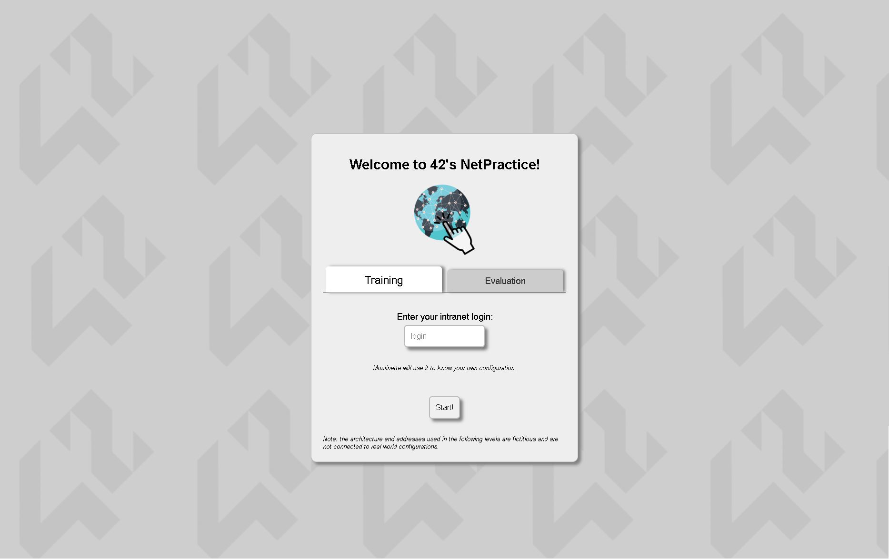

   **If the page did not open automatically**, try opening the page **manually** through the provided URL by either:
   > navigating to the URL by doing a **(ctrl + click) when hovering** on top of the URL in the terminal output

   **OR** *(**Especially** if you ran it manually with the python command)***:**
   > In your web browser navigate to the URL **with the chosen port number** like: [`http://localhost:49242`](http://localhost:49242).

## Exporting Configurations

At the **top of your window** in the exercises, you will see a button named **[Get my config]**:

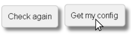

Click on it to download your configuration whenever you need to. For example, after completing an exercise.

## Submission Requirements

> Refer to the header **[Submission Details](#submission-details)**.

After exporting the configuration file:

1. Place the exported file at the **repository root**.
2. Ensure the file is included in the repository before submission.

<br>

---

# Resources

| Resource                                                                                                                                                                                                                                                                       |                                                                    Credit                                                                     | Purpose                                                |
| ------------------------------------------------------------------------------------------------------------------------------------------------------------------------------------------------------------------------------------------------------------------------------ | :-------------------------------------------------------------------------------------------------------------------------------------------: | ------------------------------------------------------ |
| [Subject PDF](en.subject.pdf)                                                                                                                                                                                                                                                  |               [](https://www.42network.org)                | Project requirements and objectives                    |
| [Free CCNA v1.1 200-301 \| Complete Course](https://youtube.com/playlist?list=PLxbwE86jKRgMpuZuLBivzlM8s2Dk5lXBQ&si=aLRmLDhJQE63_6Ah) & [CCNP ENCOR v1.1 350-401 \| Complete Course](https://youtube.com/playlist?list=PLxbwE86jKRgOb2uny1CYEzyRy_mc-lE39&si=Nh0L1UuRZhRzlQU_) | [](https://www.youtube.com/@JeremysITLab) | Primary reference for the networking topics            |
| [Writing on GitHub](https://docs.github.com/en/get-started/writing-on-github)                                                                                                                                                                                                  |           [](https://docs.github.com/en)           | Markdown formatting guide for the `README.md`          |
| [Nicholas Andre Networking Lectures](https://www.youtube.com/watch?v=g_-vbdv-wT4&list=PLmqHle8aSO_EKziRtNpYM6XHgi-jlJoD1)                                                                                                                                                      |  [](https://www.youtube.com/@mrnickandre)   | More info on networking by a great networking lecturer |
| Wikipedia                                                                                                                                                                                                                                                                      |     [](https://en.wikipedia.org/wiki/Main_Page)     | More detailed specifics and images                     |

---

## Concepts

<details>
<summary><strong>Networking</strong></summary>

# Computer Network

> A **computer network** is a collection of interconnected devices (nodes) that exchange data and share resources using agreed [communication protocols](#protocols).

Devices communicate through **wired or wireless links**, either directly or through intermediary networking devices.
> A network can operate independently without an Internet connection.

## What are Nodes?

### Nodes

> A device or logical entity participating in a network. The term can include both endpoints and intermediary devices (i.e. [networking devices](#networking-devices)).

### Hosts

> An **end system** that runs applications which originate or consume network traffic (i.e. [clients and servers](#clients-and-servers)).

### Network Interfaces

> A physical (often called ports) or virtual attachment through which a device participates in a network.

A device can have multiple interfaces. In IP networking, addresses are assigned to interfaces, one device can therefore have multiple IP addresses. Whereas each physical interface is usually assigned a globally unique MAC address, there are also locally unique MAC addresses covered in [Mac Adresses](#mac-addresses).

## Clients and Servers

> Also referred to as end-hosts or endpoints, **client** and **server** describe the roles that applications perform during communication.

These roles do not require different types of hardware. A host
can run both client and server software simultaneously.
> Both clients and servers can send and receive data. The distinction describes their service relationship, not the direction of every individual message.

A single server can serve multiple clients, and a single client can use multiple servers.

Clients and servers may be computer programs run on the same machine and connect via inter-process communication techniques. But combined with internet sockets, programs may connect to a service operating on a possibly remote system through the [Internet protocol suite](#tcpip).

### Client

> A **client** is a piece of computer hardware or software that accesses a service made available by a **server**. The server is often (but not always) on another computer system, in which case the client accesses the service by way of a network.

It accesses a server's services by sending a request to another program or a computer hardware or software on the server.

#### Types

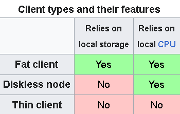

- **Thick/Rich/Fat Clients:** performs the bulk of any data processing operations itself, and does not necessarily rely on the server.
- **Thin Clients:** generally only presents processed data provided by an application server, which performs the bulk of any required data processing.
- **Diskless Nodes:** a mixture of both, it processes locally, but relies on the server for storing persistent data.

### Server

> A **server** is a computer or software system that provides data, resources, or services to **clients** on a computer network.

It first waits for potential clients to initiate connections that they may accept. Once it receives a request from the client it'll perform some action on it and send a response back, typically with a result or acknowledgment.

#### Types of Servers

There are many types of servers so I recommend checking out the table that Wikipedia provides.
> Click [here](https://en.wikipedia.org/wiki/Server_(computing)#Purpose) for the table.

## Network Scope

### LAN (Local Area Network)

> A **LAN** connects devices within a limited geographical area, typically under a common administration.

It can include both **wired Ethernet** and **wireless Wi-fi** connections, linking devices through switches and access points.
> A LAN can contain multiple [broadcast domains](#broadcast-domains). The term LAN does not necessarily mean one switch, one VLAN, or one IP subnet.

### WAN (Wide Area Network)

> A **WAN** provides connectivity across a wider geographical area, often connecting networks at different sites.

WAN connectivity can use service-provider infrastructure and can be private or Internet-based.

### The Internet

> The **Internet** is a global system of interconnected networks that communicate using the [Internet Protocol Suite](#tcpip).

The Internet provides connectivity for many services. The **World Wide Web** is one service operating over it.

# Networking Devices

## Switches

> A **network switch (also called switching hub, bridging hub, Ethernet switch, and—by the IEEE—MAC bridge)** is networking hardware that connects devices on a local network by using frame switching to receive and forward **Ethernet frames** using **MAC addresses**.

A network switch is a **multiport** network bridge that uses **MAC addresses** to forward data at the [data link layer (layer 2) of the OSI model](#layer-2-data-link-or-local-network-layer). [Layer-1](#layer-1-physical-layer) functionality is **required in all switches** in support of the higher layers.
> **Layer-3 switches** or **multilayer switches** can also forward data at the [network layer (layer 3)](#layer-3-network-or-internet-layer) by additionally incorporating routing functionality.

Switches are most commonly used as the **network connection point for hosts at the edge of a network**.

### Bridging (Layer 2 Forwarding)

A switch makes local forwarding decisions using a frame's
**destination MAC address** and the forwarding information
available for its **[VLAN](#vlans-virtual-local-area-networks)**.

A switch maintains a **MAC address table**, recording the ports through which MAC addresses are reachable by an incoming frame's **source MAC address** and associates it with the receiving port.
> Dynamic entries are updated as traffic arrives and eventually age out when they are no longer refreshed.

After that, the switch looks up the frame's **destination MAC address**. Then forwards the frame only through the port(s) associated with the destination MAC address.
> If the destination is reachable through the same port on which the frame arrived, the switch does not forward it back through that port.

### MAC Address Table

> A **MAC address table** records the ports through which MAC addresses are reachable.

A typical unicast entry records:

- **[MAC address](#mac-addresses):** the address reachable through the port.
- **[VLAN](#vlans-virtual-local-area-networks):** the Layer 2 network to which the entry belongs.
- **Port:** the interface used to reach that address.
- **Entry type:** whether the entry is learned dynamically or configured statically.

A port can lead to **multiple MAC addresses**, particularly
when it connects to another switch.

#### Content-Addressable Memory (CAM)

The table is often implemented using high-speed **Content-Addressable Memory (CAM)**, which is why it is sometimes called a **CAM table**.

> CAM, also called **associative memory**, supports lookup by content. A conventional RAM lookup supplies a memory address and retrieves data; a CAM lookup supplies search data and identifies a matching entry.
>
> The matching entry's location is a **memory location**, not a MAC or IP address.

#### Dynamic Learning

When a frame arrives, the switch examines its **source MAC address** and associates it with the **receiving port** in the appropriate VLAN.

This information allows later frames addressed to that MAC address to be forwarded toward the learned port.

> The switch **learns from the source address** and **forwards using the destination address**.

#### Updating and Aging

Further frames received from the same source refresh the dynamic entry.

If that source is subsequently learned through another port in the same VLAN, the switch can update its port association.

Entries that are not refreshed within the configured **aging time** are removed, preventing stale information from remaining indefinitely.

#### Static Entries

> A **static MAC address entry** is explicitly configured by an administrator, associating an address with a port and VLAN.

Static entries do not expire through the normal dynamic aging timer. Changes to the intended path may therefore require an administrator to update the configuration.

> A static forwarding entry does not itself assign a MAC address to the connected device.

### Layer 2 Addressing Method

> The definitons of unicast, multicast and broadcast is covered [here](#unicast-multicast-and-broadcast-assignment-ig-bit).

**Known Unicast:** If the entry points to another eligible port, the switch forwards the frame through that port. If that is the receiving port, the switch filters the frame instead.

**Unknown Unicast:** If there is no matching forwarding entry, the switch normally **floods** the frame within its [VLAN](#vlans-virtual-local-area-networks).
> **Flooding** sends copies of a frame through eligible ports in its VLAN, excluding the receiving port. Eligible ports must belong to or carry that VLAN and be permitted to forward the traffic. Flooding therefore does not necessarily mean sending through every physical port on the switch.
>> Flooding an unknown unicast frame does not change its destination address into a broadcast address.

**Broadcast:** The switch floods the frame through eligible ports in the same [broadcast domain](#broadcast-domains), excluding the receiving port.

**Multicast:** Multicast frames and are **flooded** to all points on the network in which a network interface controllers will choose to accept or ignore it based on criteria other than the matching of their individual MAC addresses. For example, based on a configurable list of accepted multicast MAC addresses.

## Routers

> **Core Function:** forwards IP packets between networks using destination IP addresses and routing information.

It operates primarily at the [Network Layer](#layer-3-network-or-internet-layer).

A router's routed interfaces attach it to different IP networks. Those interfaces can be physical or logical.

### Routing Table

A routing table describes how to reach destination networks.

A route identifies a **destination prefix** and information used to determine the **outgoing interface** and, where necessary,
a **next-hop gateway**.

Routes can be:

- **Directly connected:** derived from the router's active interface addressing.
- **Static:** explicitly configured by an administrator.
- **Dynamic:** learned through routing protocols.

The router selects the **most specific matching route**. A default route is used when no more specific route matches.

> See [How Is the Next Hop Determined?](#how-is-the-next-hop-determined) for the forwarding decision.

### Default Gateway

> A **default gateway** is the next-hop router used by a default route.

On a typical Ethernet LAN, a host uses the IP address of a directly reachable router interface as its gateway.

A more specific route takes precedence over the default route.

### Forwarding Between Links

The router processes the incoming link-layer encapsulation, examines the IP packet, and prepares an appropriate outgoing link-layer frame.

When forwarding IPv4 traffic, it decrements the packet's **TTL**. A packet whose TTL expires is discarded.

Each router independently chooses the next forwarding step.

</details>
<details>
<summary><strong>TCP/IP</strong></summary>

# TCP/IP

> The **Internet Protocol Suite**, often called **TCP/IP**, is a family of protocols that enables communication over networks.

Such Protocols include:

- `IP`
- `TCP`
- `UDP`
- `HTTP`
- `HTTPS`
- `DNS`
- `ICMP`
- `Ethernet`
- `Wi-Fi`

From this suite of protocols we can **group these protocols into layers** based on their **specific services and responsibilities** to build what we call the **TCP/IP model**.

It has a similar structure to the [OSI Model](#osi-model), but with fewer layers *(usually `4` or `5`)*.

> The TCP/IP protocol suite underpins the Internet.

---

# Protocols and Standards

## Protocols

> A **protocol** is a set of rules that defines how data is communicated between devices.

Think of it as a **language** for devices, devices using incompatible protocols can't communicate between each other.

### Issues in the Early Days

In the **early days of networking**, vendors often defined **proprietary protocols for their own products**. This made communication with other vendors' products difficult.

## Standards

> A **standard** is an agreed-upon specification describing how a technology or protocol should operate.

To solve the [issue](#issues-in-the-early-days) discussed, **today's** networks use **standard, vendor-neutral** protocols and technologies.

Think of it like the **blueprint or ruleset** of the protocols defined by **standards organizations and communities**, protocols are **defined** based on the declared **standard** to ensure compatibility between different vendors' products.

For example, a MacBook can access a website hosted on a Linux server because both support the relevant standardized protocols.

# History of TCP/IP

## ARPANET

> **ARPANET** is a network that came online in **1969** to connect mainframes at U.S. universities and research laboratories

*It was funded by the US Department of Defense's **ARPA** (Advanced Research Projects Agency)*

It used a protocol called **NCP** (Network Control Program) as TCP/IP did not exist yet.
> NCP was completed in 1970 and implemented during 1971–1972.

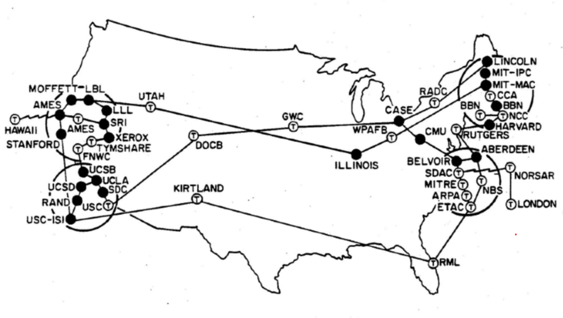

## The Development of TCP

In **1973**, *Vint Cerf* and *Bob Kahn* from *DARPA (Defense Advanced Research Projects Agency)* began developing the **Transmission Control Program (TCP)**. They published their design in 1974.

The protocol later evolved into two protocols:

- **Transmission Control Protocol (TCP)**
- **Internet Protocol (IP)**

These two protocols form the foundation of the protocol suite widely known as **TCP/IP**.

> ARPANET transitioned fully to TCP/IP in **1983**.

TCP/IP became dominant because it:

- was based on open standards
- could be implemented by any vendor
- could operate over many different types of networks

# Standards Organizations

## IEEE (Institute of Electrical and Electronics Engineers)

> **IEEE** develops many local networking technologies used on **local area networks (LAN)**.

They define the standards for the **physical specifications** and **message formats** of technologies such as:

- **Ethernet** *(IEEE 802.3)*
- **Wi-Fi** *(IEEE 802.11)*

## IETF (Internet Engineering Task Force)

> **IETF** is an **open community** that defines and develops many protocols used across the Internet.

They publish their standards in documents called **RFCs (Requests For Comments)** for their protocols such as:

- TCP
- IP
- UDP
- HTTP
- DNS

# Layered Models

Networking **involves many different jobs** to transmit a message from one device to another.

> Therefore, a **model** is a conceptual framework for organizing networking functions that groups related jobs into layers so that **each layer** can provide its **specialized** services to the layer above using the services of the layer below **(Adjacent-layer interaction)**.

Each protocol **primarily** operates at a particular layer, although real implementations may involve interactions across layers.

Aside from **adjacent-layer interaction**, when each layer **logically communicates** to its corresponding layer on other devices it's called **same-layer interaction**.

The layers are **modular**. We can replace the protocols at different layers without redesigning the entire stack, provided the replacement preserves the services and interfaces that other layers depend on.

> A network stack is **a set of networking protocols** and their implementations that **work together across layers**.

Different sources use models with varying numbers of layers, notably:

- 4-layer TCP/IP models
- 5-layer TCP/IP models
- [7-layer OSI models](#osi-model)

*The following table shows various such networking models. The number of layers varies between three and seven.*

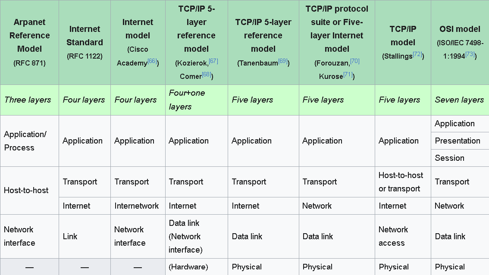

## The TCP/IP Model

> We'll be using a **5-layer TCP/IP model** for our example TCP/IP model.

|                           Layer                            | Purpose                                                                                              |
| :--------------------------------------------------------: | ---------------------------------------------------------------------------------------------------- |
|     [Application](#the-upper-layers-of-the-osi-model)      | Protocols for communication between application processes; to create and interpret data              |
|           [Transport](#layer-4-transport-layer)            | Provides end-to-end communication between application processes by port numbers                      |
|       [Internet](#layer-3-network-or-internet-layer)       | Provides host-to-host packet delivery across interconnected networks using IP addressing and routing |
| [Local Network](#layer-2-data-link-or-local-network-layer) | Provides node-to-node delivery within a local network using MAC addresses and switches               |
|            [Physical](#layer-1-physical-layer)             | Sends bits as electrical, optical, or radio signals over the physical medium                         |

> For a detailed description of the layers, including OSI layers 5–7, refer to the [OSI Layers](#osi-layers) section.

# Data Flow

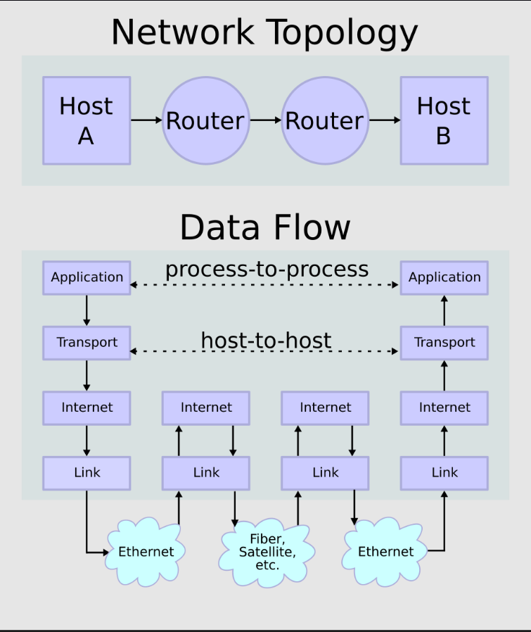

# Encapsulation & Decapsulation

## Encapsulation

> **Encapsulation** is the process of adding information as data moves **down** the protocol stack.

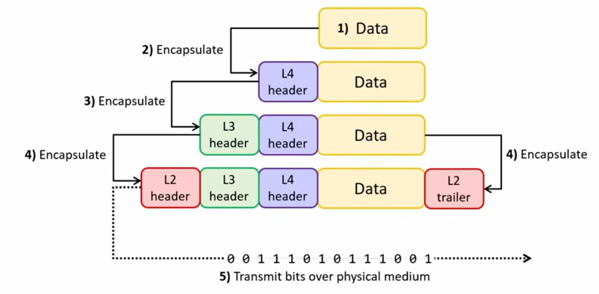

**Data** is prepared by the Application layer of the TCP/IP model (the abstraction of the top 3 [upper layers of the OSI model](#the-upper-layers-of-the-osi-model)).

As the message moves down the stack, each layer encapsulates the data with a **header** including the information needed for that layer.

Layer 2 also adds a **trailer** that the receiving device uses to **check for transmission errors**.

As the image suggests, the **L2 header** is transmitted first, and the **L2 trailer** is transmitted last.

## Decapsulation

> The **reverse process** of encapsulation.

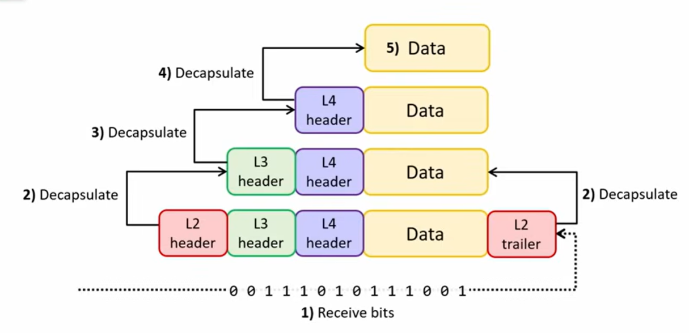

Each step **examines** the information in the layer it's involved in (L2 trailer + header > L3 header > L4 header), then **removes** them as they go **up** the stack until the **data** is delivered to the layer 5.

The application processes the data and, if needed, generates a response that goes back down the stack.

# Protocol Data Units (PDUs)

> A **Protocol Data Unit (PDU)** is a single unit of information composed of protocol-specific control information and user data.

The contents of each PDU (everything encapsulated by that layer's header/trailer) are called the **payload**.

## Layer 4 PDU

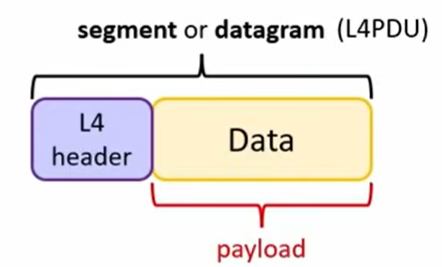

|                  segment                  |              datagram              |
| :---------------------------------------: | :--------------------------------: |
| [TCP](#tcp-transmission-control-protocol) | [UDP](#udp-user-datagram-protocol) |

## Layer 3 PDU

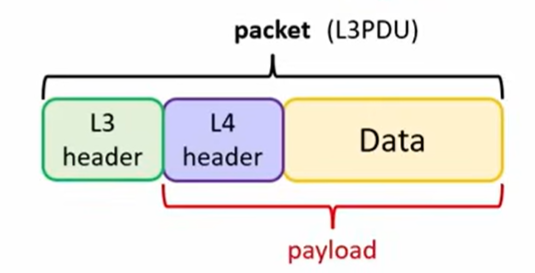

## Layer 2 PDU

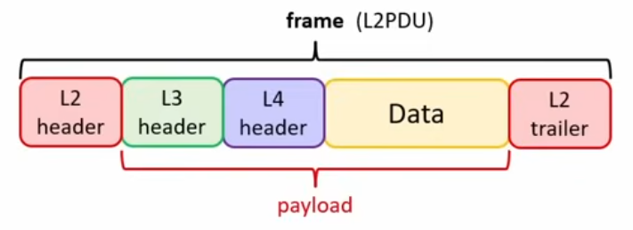

<br>

---

</details>
<details>
<summary><strong>OSI</strong></summary>

# OSI Model

> **Open Systems Interconnection (OSI) Model**, often called **OSI Model**, is a conceptual model that categorizes and standardizes the different functions in a network.

The goal was to create international, vendor-neutral networking standards that could unify existing proprietary stacks and potentially replace [TCP/IP](#tcpip).

OSI protocols ended up being **too late** and **complex**, so TCP/IP *"won"* in **real world deployment**, although some OSI technologies are still used.

> Although it's **not** the model used in modern networks, it still influences how network engineers think and talk about networks. It remains useful as a reference and teaching model and provides common terminology for discussing layers along with their functions.

## History

It was published by the *International Organization for Standardization (ISO)* in *1984*.

Governments, including the US, **promoted** OSI as the preferred/recommended stack for **new deployments**.

# OSI layers

> # The bottom layers of the OSI Model
>
> In TCP/IP networks, the responsibilities of the bottom 2 layers (L1 & L2) are often implemented together by networking hardware and supporting software to provide local network connectivity. Thus the [TCP/IP Model](#the-tcpip-model) groups them under a broader **Network Access/Link Layer**, commonly compared with OSI Layers 1 and 2.

## Layer 1: Physical Layer

> **Core Function:** Transmits and receives raw bitstreams over physical media using electrical, optical, or radio signals.

It defines the physical, electrical, and mechanical specifications for carrying raw bits (`1`s and `0`s) across a connection. Layer 1 standards govern **physical signaling** (voltage levels, light pulses, radio frequencies) rather than message structure.

### Key Focus Areas

- **Hardware:** Cables, connectors, pinouts, Network Interface Cards (NICs)
- **Transmission Dynamics:** Signal levels, voltage, bit rates, link speeds

### Common Media Types

- **Copper:** UTP / STP cables (e.g., 1000BASE-T Ethernet signaling)
- **Optical:** Single-mode and multi-mode fiber optic cables (e.g., 10GBASE-LR)
- **Wireless:** Wi-Fi radios and antennas (e.g., 2.4GHz / 5GHz RF modulation)

## Layer 2: Data Link (or Local Network) Layer

> **Core Function:** delivers a **frame** across a local network/link using MAC addresses and Layer 2 protocols.

It defines how data is formatted for transmission over a physical medium. It detects and possibly corrects [Physical Layer (Layer 1)](#layer-1-physical-layer) errors.

It uses **MAC (Media Access Control) addresses** to identify network interfaces and performs **[hop-to-hop delivery](#what-is-a-hop)** on **frames** across a local link using **node-to-node delivery**.

> # MAC Addresses
>
> A **MAC (Medium/Media Access Control) address**, often referred to as the **burned-in address**, or as an **Ethernet hardware address**, **hardware address**, or **physical address**, is a unique identifier assigned to a network interface controller (NIC) for communication at the Data Link Layer.
>
> A device can have multiple physical or virtual network interfaces, each using its own MAC address.
>
> ## MAC Address Structure
>
> A MAC address is a **48-bit (6-byte)** identifier divided into **6 octets**, with each octet containing **8 bits**.
>
> 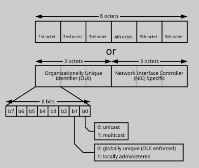
>
> The most significant (first) octet contains two significant control bits that dictates the address type, b0 (least significant bit) and b1 (second least significant):
>
> |  bit   |                                     **name**                                     |      **value `0`**       |    **value `1`**     |
> | :----: | :------------------------------------------------------------------------------: | :----------------------: | :------------------: |
> | **b0** | [I/G (Individual/Group) bit](#unicast-multicast-and-broadcast-assignment-ig-bit) |        individual        |        group         |
> | **b1** |       [U/L (Universal/Local) bit](#universal-and-local-assignment-ul-bit)        | universally administered | locally administered |
>
> ## MAC Address Format
>
> MAC addresses are commonly written as **12 hexadecimal digits**, with each digit representing **4 bits**. Therefore, two hexadecimal digits make up one **octet (8 bits)**.
>> Separators such as `:`, `-`, or `.` are only formatting conventions, and hexadecimal letters are **case-insensitive**.
>>
>> For example, all of the following represent the same MAC address:
>
> 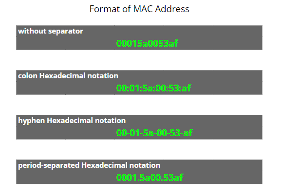
>
> ### Universal and Local Assignment (U/L bit)
>
> - **Universally Administered Address (UAA)**
>
>   Assigned by the device manufacturer.
>
>   The first three octets (24 bits) in transmission order contain the **Organizationally Unique Identifier (OUI)**. The organization assigns the remaining octets that makes it unique.
>   > **OUI** uniquely identifies a vendor, manufacturer, or other organization.
>
> - **Locally Administered Address (LAA)**
>
>   Assigned locally by software or an administrator.
>
>   It can override the burned-in address of a physical device.
>
> > The familiar **24-bit OUI + 24-bit extension** structure applies to MA-L assignments, rather than every MAC address.
>
> #### Unicast, Multicast and Broadcast Assignment (I/G bit)
>
> - **Unicast:** addresses to an **individual interface** one-to-one transmission from one point (one sender) in the network to another point (one receiver) within a collision domain.
> - **Multicast:** addresses to a **group of interfaces** simultaneously, can be one-to-many or many-to-many.
> - **Broadcast:** addresses by **flooding all interfaces** in the local [broadcast domain](#broadcast-domains) using a one-to-all association.
>   > The Ethernet broadcast address is **`FF:FF:FF:FF:FF:FF`**, with all 48 bits set to `1`.

### Node-to-Node Delivery?

> **Node-to-node delivery** describes the transfer of a frame between adjacent devices along a local network path.

A frame may pass through intermediate switches before reaching its intended local recipient.

Ordinary Ethernet bridging preserves the frame's source and destination MAC addresses. An intermediate switch does not replace the source address with its own.
> This is partly why [switches are not considered a hop](#why-layer-2-switches-do-not-count-as-hops).

Layer 2 provides the local delivery needed to reach the [next hop](#what-is-a-hop) selected by Layer 3.

### Broadcast Domains

> A **broadcast domain** is the set of interfaces that a Layer 2 broadcast can reach through the network's forwarding connections.

All devices conected to a switch are in the same broadcast domain, thus switches can extend a broadcast domain across multiple ports and links.
> VLANs can be used to divide up broadcast domains in a switch.

**Routing interfaces** form boundaries between Layer 2 broadcast domains. Ordinary IP routing (Routers) does not carry the original Ethernet broadcast frame into another domain.

> A broadcast domain can span multiple switches, while one switch can support multiple broadcast domains through VLANs.

### VLANs (Virtual Local Area Networks)

> A **VLAN** logically separates a switched network into distinct Layer 2 broadcast domains.

Devices can share physical switching infrastructure while belonging to different VLANs.

### Protocols Used

``` text
Ethernet (IEEE 802.3)
Wi-Fi (IEEE 802.11)
```

## Layer 3: Network (or Internet) Layer

> The Internet (internetwork = between networks) Layer provides **host-to-host packet delivery between hosts** across multiple networks using IP addressing and routing.

It uses **IP addresses** to identify the hosts in the network.

**Routers** operate primarily at Layer 3 and examine Layer 3 information, especially the destination IP address, to determine where to forward the message toward its destination host.

> The destination IP remains the same throughout the network path (Assuming no **Network Address Translation (NAT)** that can rewrite IP addresses).

### What is a Hop?

> A **hop** is one step towards the next router or directly reachable destination host along a packet's path.

Layer 3 selects the **next hop**, and Layer 2 carries the
packet across the local network to reach it using **[node-to-node delivery](#node-to-node-delivery)**.

#### Why Layer 2 Switches Do Not Count as Hops

Layer 2 switches forward frames locally **without modifying the IP TTL header** unlike Layer 3 routing hops. Essentially they're **part of the Layer 2 infrastructure** connecting devices on the local network.

A router decrements the TTL when forwarding an IP packet.

#### Example Path

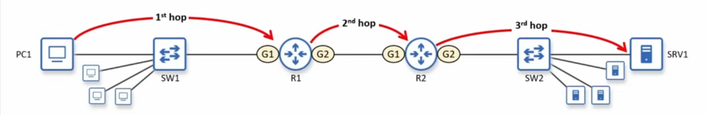

*Legend: (G1) & (G2) = Router interfaces (GigabitEthernet ports)*

For each Ethernet hop, the sender places the packet in a frame addressed to the next hop's MAC address, obtained from its **ARP cache or through ARP**.

### How Is the Next Hop Determined?

A host or router checks the packet's destination IP against its
routing table and selects the most specific matching route.

- **Directly connected destination:** send to the destination itself.
- **Route through a gateway:** send to that gateway.
- **No more specific match:** use the default route, if available.

Each router repeats this decision using its own routing table.

On an IPv4 Ethernet network, the sender needs the next hop's **MAC address**.

It checks its ARP cache and, if necessary, sends an **ARP (Address Resolution Protocol) request** to resolve the chosen next-hop IP address to a MAC address.

### Protocols Used

``` text
IP (IPv4, IPv6)
ICMP (Internet Control Message Protocol)
```

## Layer 4: Transport Layer

> **Core Function:** provides **end-to-end (process-to-process or host-to-host) communication** between applications running on hosts.

A host can run **multiple network applications simultaneously**. Layer 4 is the one to add the information ([port numbers](#port-numbers)) needed to **distinguish the applications' communication endpoints** on those hosts.

The communicating hosts handle the Transport Layer. Intermediate routers **normally** forward the packets using [Layer 3 information](#layer-3-network-or-internet-layer), so the transfer of layer 4 data is **transparent** to the lower levels.

### Port Numbers

> A **port number** is a 16-bit logical number that identifies a transport endpoint on a host. *NOT the physical interfaces/ports on network devices*.

It identifies the Application Layer protocol and provides session multiplexing.
> Session multiplexing is the process of running several message streams or sessions onto one logical link and keeps track of which messages belong to which sessions.

*Internet Assigned Numbers Authority (IANA)* divided the port numbers into **three** ranges:

- **[Well-known/*system ports* (0–1023)](https://en.wikipedia.org/wiki/List_of_TCP_and_UDP_port_numbers#Well-known_ports)**: **System processes** that provide widely used types of network services.

- **[Registered ports (1024–49151)](https://en.wikipedia.org/wiki/List_of_TCP_and_UDP_port_numbers#Registered_ports)**: Assigned for specific services upon application by a **requesting entity/vendor**.

- **[Dynamic/private/ephemeral ports (49152–65535)](https://en.wikipedia.org/wiki/List_of_TCP_and_UDP_port_numbers#Dynamic,_private_or_ephemeral_ports)**: Private or customized services, temporary purposes, and automatic allocation of ephemeral ports. *(cannot be registered with IANA)*

*Click the hypertext links to explore their respective Wikipedia’s table of port numbers and their associated services.*

### Protocols Used

```text
TCP (Transmission Control Protocol)
UDP (User Datagram Protocol)
```

### TCP (Transmission Control Protocol)

> TCP is a **connection-oriented** protocol that provides reliable, ordered byte-stream delivery.

TCP takes the application's data as a **continuous byte stream**, then **segments that byte stream** into TCP segments for transmission.

<p align="center">TCP segment header</p>

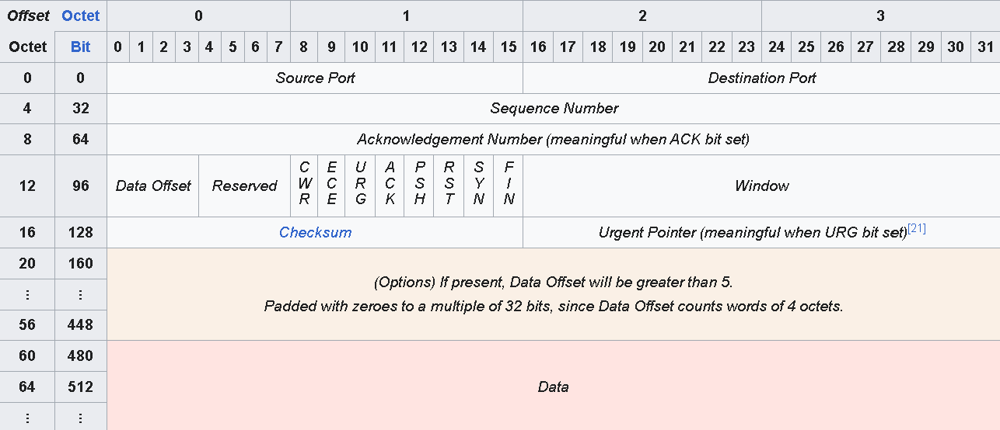

#### How it ensures **Connection and Termination**

| 3-Way handshake (Establishment) | 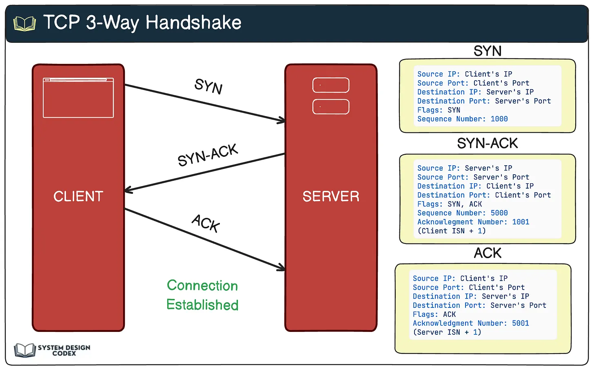 |
| :-----------------------------: | :------------------------------------------------------: |
|  4-Way Handshake (Termination)  |  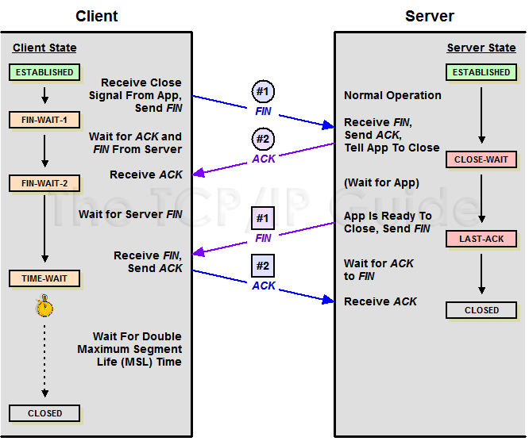  |

When establishing the connection, each endpoint will calculate their local receive **Maximum Segment Size (MSS)** and advertise it to the other. Each sender limits TCP payload size using its peer's MSS and the path constraints.

#### Features to ensure **reliable data transfer:**

- **Data sequencing**

   It **segments** the byte stream into payloads limited by the receiver's MSS and path constraints assigns **sequence numbers** to the **bytes** to track the order for reassembly.
   > The **Initial Sequence Number (ISN)** is generated to be difficult to predict during the establishment phase.
- **Reliable data transfer**

   The destination host acknowledges received TCP data by sending an **acknowledgement number** with the ACK flag set.

   The acknowledgement number represents the **sequence number of the next byte the receiver expects**.
   > If data is missing but later data still arrives, the receiver continues acknowledging the first missing byte until the gap is filled.
- **Error recovery**

   If a segment remains unacknowledged until the **Retransmission Timeout (RTO)** expires, or if the sender receives **3 duplicate ACKs**, the sender retransmits the missing data.

   Once the missing segment is successfully received and fills the gap, the receiver sends a **cumulative ACK** acknowledging all contiguous data that had previously been buffered.
- **Flow control**

- **Flow control**

   The receiver advertises a **receive window (rwnd)** based on its available buffer capacity. This **window size**, measured in bytes, limits how much unacknowledged data the receiver allows the sender to have outstanding.

   TCP uses a **sliding window**, when an ACK acknowledges new bytes, the window's left edge advances to the acknowledgment number (like sliding to the right). This can make room for more data to be sent while respecting the receiver's advertised capacity.
   > The sender also maintains a **congestion window (cwnd)** to account for network conditions. Normally, the smaller of `rwnd` and `cwnd` limits outstanding data.

### UDP (User Datagram Protocol)

> UDP is a **message-oriented, connectionless** protocol that sends individual messages called **datagrams** without providing guaranteed delivery.

UDP takes **each application message** as a **separate UDP datagram**.

#### What makes UDP message-oriented?

- **Boundary Preservation**

   Since each message is sent as an individual datagram, each application message is a **separate, recognizable unit** during transport.
   > No framing or delimiter is needed to distinguish messages like TCP.
- **Best-effort delivery**

   UDP does not establish a connection before sending data nor does it provide TCP's mechanisms that **guarantee reliable and ordered delivery**.

   Each datagram is sent **independently** without waiting for any acknowledgement from the receiver.
   > If reliability is required, the **application layer** must implement the necessary mechanisms itself.
- **Error detection**

   UDP includes a checksum that can detect corruption in the UDP header and payload. The UDP checksum can be disabled in IPv4.
   > It's **not error recovery**. A corrupted datagram can be discarded, but UDP does not retransmit it.
- **Low overhead**

   UDP has a small **8-byte header**:

   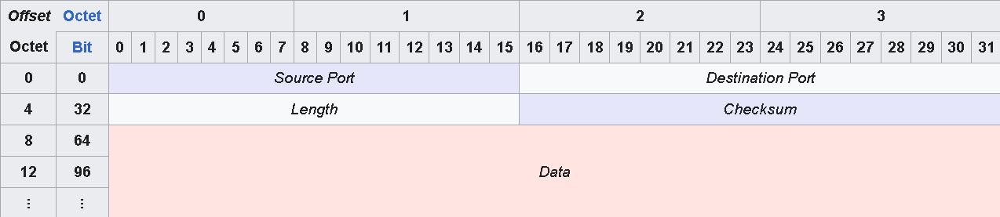

   > This can **reduce latency and processing overhead**, but UDP does **not inherently guarantee a faster transmission rate** than TCP.

If the IP packet carrying a UDP datagram exceeds the outgoing link's **Maximum Transmission Unit (MTU)**, **IPv4 fragmentation** may occur (different from TCP segmentation). UDP itself still treats the application message as **one datagram**.
> MTU (Maximum Transmission Unit) is the largest amount of data that a network link can carry in a single Layer 3 packet without fragmentation.

<br>

---

> # The upper layers of the OSI Model
>
> In TCP/IP networks, the responsibilities of the top 3 layers (L5–L7) are often implemented together by application protocols and supporting software to form the data payload. Thus the [TCP/IP Model](#the-tcpip-model) groups them under a broader **Application Layer**, commonly compared with OSI Layers 5–7.
>
> Modern TCP/IP applications commonly implement the session (L5) and presentation (L6) functions they need within application protocols (L7) or supporting libraries, without using a separate OSI Session Layer protocol.

## Layer 5: Session Layer

> **Core Function:** establishes, manages, synchronizes, and terminates communication sessions used by applications.

It uses the services of the [Transport Layer](#layer-4-transport-layer) to organize the dialogue between communicating endpoints.

Where supported, it provides mechanisms for the upper layers to establish agreed **synchronization points** and coordinate returning to an agreed point after an interruption.
> Session synchronization supports recovery, but does not automatically save application progress or make every transfer resumable.

### What is a Session?

> A **session** is an organized dialogue between communicating applications, with agreed rules for managing their interaction.

**Session management** coordinates how that dialogue begins, progresses,
and ends.

### Protocols Used

```text
OSI connection-oriented Session Protocol (ITU-T X.225)
```

## Layer 6: Presentation Layer

> **Core Function:** manages how data is represented so that communicating applications can interpret it consistently.

It translates between the application's internal representation and an agreed format for transmission, using the services of the [Session Layer](#layer-5-session-layer).

### Key Functions

- **Translation and Encoding**

   Converts data into an agreed format for transmission and interpret the received representation at the receiving endpoint. This includes rules for:

  - **Character encoding:** ASCII / UTF-8
  - **Numeric representation:** integer sizes / byte order / floating-point formats
  - **Structured-data representation:** JSON / XML
  - **Image representation and compression:** JPEG / PNG

- **Encryption and Decryption**

   Protects the **confidentiality** by transforming readable data like plaintext into an encrypted representation like ciphertext and decrypts it at the receiving endpoint using the appropriate keys.
   > Encryption is not mandatory for every exchange, but it prevents observers without the key from reading its contents. Encryption can also be implemented at other layers.

- **Compression and Decompression**

   Compacts the data to reduce the amount transmitted, the receiving endpoint will decompress it.
   > Just like encryption, compression is also not mandatory for every exchange, but it does reduce packet sizes, save network bandwidth, and speed up communication over slow or congested links.

### Protocols Used

```text
OSI connection-oriented Presentation Protocol (ITU-T X.226)
```

## Layer 7: Application Layer

> **Core Function:** provides network services to applications and defines the rules for application-level communication.

It defines the **messages, operations, and responses** that communicating applications use to exchange information. It describes the **network communication functions** used by applications, rather than the application itself and its functions.

### Protocols Used

```text
HTTP/HTTPS (Accessing web resources and services)
FTP, TFTP (Transferring files)
SMTP (Sending and relaying email)
POP3, IMAP (Accessing received email)
DNS (Resolving domain names and retrieving DNS records)
SSH (Secure remote access)
```

> Depending on the resource's numbering convention, the application layer may be called Layer 4, 5, or 7. Some resources retain OSI numbering when describing TCP/IP, labeling it Layer 7 even though session and presentation functions are grouped into the application layer rather than shown as separate layers.

<br>

---

</details>

---

## AI Usage

AI was used as a **supplementary learning** and **clarification tool** during this project.

I used AI to:

- ✅ Ask questions about concepts encountered in the provided resources *(requesting the exact section/line/timestamp for verification)*
- ✅ Clarify concepts that were difficult to understand.
- ✅ Explore hypothetical situations that were not covered in the provided resources.
- ✅ Perform a first layer of double-checking and verification of my work.
- ✅ Improve the readability of my content.
- ❌ Generate or solve the project's exercises.
- ❌ Write the content of the `README.md`.

I completed the NetPractice exercises and wrote the `README.md` **manually**.

<br>

---

# Submission Details

As stated in the [](en.subject.pdf):
> 10 exported configuration files (one per level) must be placed at the repository root
